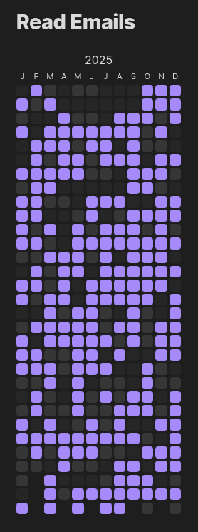
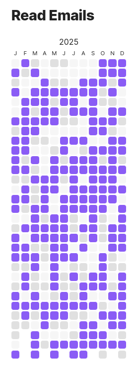

# Every Day Calendar

Create habit trackers through [dataviewjs](https://blacksmithgu.github.io/obsidian-dataview/api/intro/) !



<!-- Full screen screenshot cropped through https://bulkimagecrop.com/ -->

The layout is inspired by Simone Giertz's [Every Day Calendar](https://yetch.store/en-eur/products/every-day-goal-calendar), and the idea to make a plugin in the first place from Richard Slettevoll's [Heatmap Calendar](https://github.com/Richardsl/heatmap-calendar-obsidian).

Here is the code for the above:
````markdown
# Read Emails

```dataviewjs
everyDayCalendar(this.container, 2025, date => {
	// generates random number in {0, 1, 2} with bias towards 2
	return Math.min(Math.floor(Math.random() * 5), 2)
})
```
````

As you can see, you only need to give it the desired year, and a function from `Date` to a number which represents how done is the task that day.
The default idea is that 1 and 2 mean the task was not done (resp done) that day, and 0 means the day is missing or invalid (for example if you were on vacation).
The colors are taken directly from Obsidian, so they adjust with your theme.

It's also possible to define custom CSS to support more values and/or more colors, see [Customization](#customization). 

**Important:** You need the [Dataview plugin](obsidian://show-plugin?id=dataview) for `dataviewjs` blocks to work, and therefore this extension !

### Example

Here is how you can extract whether you've done a task some day:

```javascript
const property = "Set this as you wish"

const defaultValue = 0
everyDayCalendar(this.container, 2025, d => {
	const name = d.toISOString().substring(0,10)
	const page = dv.page(name)
	if (page) {
		const res = page.file.tasks.values.some(e => e.text === property && e.completed)
		return 1 + res
	} else {
	    return defaultValue
	}
})
```
This assumes your days are named `YYYY-MM-DD` and that there is only one page per such name in your vault

## Customization

All customization is done through CSS snippets, see https://help.obsidian.md/Extending+Obsidian/CSS+snippets

### Changing the colors (or adding more)

The color for a day are looked up according to the value returned by the function passed to `everyDayCalendar`.
For example if you want the colors for value 0 to be red, you can add the following to a snippet:

```css
.every-day-calendar.box[value="0"] {
    background-color: red;
}
```

You can also add values:
```css
.every-day-calendar.box[value="4"] {
    background-color: #00a400;
}
```

If the color appears as a very saturated pink (`#FF00FF`) it means no CSS was found for that value.
The most common reasons are typos or forgetting to put the number in quotes (`value=0` will not work).

For a full reference of the usable colors, see [usual CSS colors](https://developer.mozilla.org/en-US/docs/Web/CSS/color_value), [obsidian theme-dependent colors](https://docs.obsidian.md/Reference/CSS+variables/Foundations/Colors) and [default obsidian colors](https://publish.obsidian.md/hub/04+-+Guides%2C+Workflows%2C+%26+Courses/Guides/Default+Obsidian+Theme+Colors)

Here are the default values for the extension:

```css
.every-day-calendar.box[value="0"] {
    background-color: var(--background-secondary);
}

.every-day-calendar.box[value="1"] {
    background-color: var(--background-modifier-border);
}

.every-day-calendar.box[value="2"] {
    background-color: var(--text-accent);
}
```

### Modifying a single calendar

CSS snippets apply to the whole Vault, to personalize a single calendar:

1. Add an additional class through `additionalClasses`:
```javascript
everyDayCalendar(this.container, 2025, date => {
	return Math.min(Math.floor(Math.random() * 5), 2)
}, {additionalClasses: ["myExample"]})
```
1. In your snippet, add the corresponding [class selector](https://developer.mozilla.org/en-US/docs/Web/CSS/Class_selectors):
```css
.myExample.every-day-calendar.box[value="0"] {
	background-color: black
}
```

## Building locally

### The first time

- Clone this repo, for example in your vault's `.obsidian/plugins` folder
- Run `npm i` (from NodeJS)
- Run `npm run dev` every time you work on the repo
- Enable the plugin in the settings (in Community plugins)
- When you want to check a change, reload Obsidian (the rest is done continuously by `npm run dev`)

### The following times

- Run `npm run dev`
- When checking changes, reload Obsidian

Quick starting guide for new plugin devs:

### In case the api gets updated 

- Run `npm update`

For more information about plugin development, please consult https://docs.obsidian.md/Plugins/Getting+started/Build+a+plugin and https://github.com/obsidianmd/obsidian-sample-plugin
